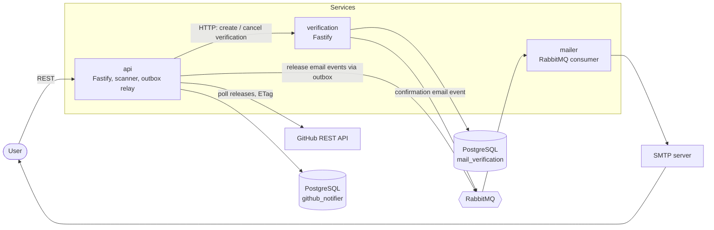

# GitHub Release Notifier

A self-hosted service that sends email notifications when a GitHub repository publishes a new release. Users subscribe to `owner/repo` through a REST API, confirm the subscription by email, and are notified whenever a new release tag is detected.

The system is built as a small **microservices** architecture in a pnpm + Turborepo monorepo. Services communicate over **RabbitMQ** (events) and HTTP (the subscribe saga), and share typed message contracts.

## Architecture



| Service | Path | Responsibility |
|---|---|---|
| **api** | `apps/api` | Public REST API (subscribe, confirm, unsubscribe, list), GitHub release scanner, transactional outbox relay |
| **verification** | `apps/verification` | Creates and cancels email verifications, publishes the confirmation email event |
| **mailer** | `apps/mailer` | Consumes email events from RabbitMQ, renders templates and sends them via SMTP |
| **contracts** | `packages/contracts` | Shared event/request types, schemas, exchange and routing keys |

### Subscribe saga (orchestrated by `api`)

1. **T1 (local):** create a pending subscription. On failure of later steps: delete it.
2. **T2 (remote):** ask `verification` to create a verification token. It publishes a confirmation email event. On failure: delete the subscription.
3. **T3 (local):** store the confirm token and set the status to `awaiting_confirmation`. On failure: cancel the verification, then delete the subscription.

Compensations are best-effort and never mask the original error.

### Release notifications (transactional outbox)

1. The scanner polls GitHub for each tracked repository using conditional requests (`ETag` / `If-None-Match`), so unchanged repositories return `304` and don't cost rate limit. It pauses when GitHub rate-limits it.
2. When a new tag is found, the scanner writes one event per confirmed subscriber to an **outbox table** in the same database transaction as the repository update.
3. The outbox relay publishes pending events to RabbitMQ in batches, with retries (max 5), and marks them processed or failed.
4. `mailer` consumes the events and sends the emails. Delivery is **at-least-once**: a duplicate is acceptable, a lost notification is not.

## Tech stack

| Area | Technology |
|---|---|
| Runtime / language | Node.js 22, TypeScript |
| HTTP framework | Fastify 5 |
| Messaging | RabbitMQ (`amqplib`) |
| Database | PostgreSQL 16 (one database per service) |
| Query builder / migrations | Kysely at runtime, Prisma for migrations only |
| Email | Nodemailer (Mailpit in development) |
| Monorepo | pnpm workspaces + Turborepo |
| Testing | Vitest, Testcontainers (integration) |
| Observability | Prometheus + Grafana (metrics), pino + Elasticsearch + Kibana (logs) |
| CI/CD | GitHub Actions, Docker images on GHCR |

## Repository layout

```
apps/
├── api/            # REST API, scanner, outbox relay  (port 3000)
├── verification/   # verification service              (port 3002)
└── mailer/         # RabbitMQ email consumer
packages/
└── contracts/      # shared event + request contracts
docs/
├── adr/            # architecture decision records
└── system-design.md
infra/              # Prometheus, Grafana, Postgres init
docker-compose.dev.yml
docker-compose.prod.yml
```

## API

All endpoints are served by the `api` service.

| Method | Path | Description |
|---|---|---|
| `POST` | `/api/subscribe` | Subscribe an email to a repository. Body: `{ "email": "you@example.com", "repository": "owner/repo" }`. `404` if the repository does not exist on GitHub, `409` on a duplicate. |
| `GET` | `/api/confirm/:token` | Confirm a subscription (link from the confirmation email). |
| `GET` | `/api/unsubscribe/:token` | Delete a subscription (link in every notification email). |
| `GET` | `/api/subscriptions?email=you@example.com` | List confirmed subscriptions for an email. |
| `GET` | `/metrics` | Prometheus metrics. |

The `verification` service exposes an internal HTTP API used by the saga: `POST /verifications` and `POST /verifications/cancel`.

## Running with Docker

```bash
git clone https://github.com/matshp0/GithubRealeaseNotifier.git
cd GithubRealeaseNotifier

# the scanner needs a GitHub token (public_repo scope, or no scope for public repos)
echo "GITHUB_TOKEN=<your token>" > apps/api/.env.development

docker compose -f docker-compose.dev.yml up --build
```

| Service | URL | Description |
|---|---|---|
| api | http://localhost:3000 | REST API |
| verification | http://localhost:3002 | Verification service |
| Mailpit | http://localhost:8025 | Inbox for outgoing emails |
| RabbitMQ | http://localhost:15672 | Management UI |
| Prometheus | http://localhost:9090 | Metrics |
| Grafana | http://localhost:3001 | Dashboards |
| Kibana | http://localhost:5601 | Logs |
| PostgreSQL | localhost:5432 | Databases |

Database migrations run automatically through the `migrate` and `verification-migrate` services on startup.

Try it:

```bash
curl -X POST http://localhost:3000/api/subscribe \
  -H 'content-type: application/json' \
  -d '{"email":"you@example.com","repository":"nodejs/node"}'
# open http://localhost:8025 and click the confirmation link
```

`docker-compose.prod.yml` runs the published images from GHCR and reads its configuration from environment variables.

## Running locally (without Docker)

Prerequisites: Node.js 22, pnpm (`corepack enable`), PostgreSQL, RabbitMQ, an SMTP server (for example Mailpit).

```bash
pnpm install
pnpm db:migrate     # api migrations
pnpm dev            # runs all services through Turborepo
```

## Configuration

| Variable | Service | Description | Default |
|---|---|---|---|
| `PORT` | api, verification | HTTP port | `3000` / `3002` |
| `POSTGRES_HOST`, `POSTGRES_PORT`, `POSTGRES_USER`, `POSTGRES_PASSWORD`, `POSTGRES_DATABASE` | api, verification | PostgreSQL connection | |
| `DATABASE_URL` | migrations | Connection string used by Prisma | |
| `RABBITMQ_URL` | all | RabbitMQ connection | `amqp://localhost:5672` |
| `GITHUB_TOKEN` | api | GitHub personal access token | |
| `SCAN_INTERVAL` | api | Minutes between GitHub polls | `5` |
| `APP_URL` | api, mailer | Public base URL used in email links | `http://localhost:3000` |
| `MAIL_VERIFICATION_URL` | api | Base URL of the verification service | |
| `MAIL_HOST`, `MAIL_PORT`, `MAIL_USER`, `MAIL_PASS` | mailer | SMTP settings (empty user skips auth) | port `587` |
| `ELASTICSEARCH_URL`, `ELASTICSEARCH_USER`, `ELASTICSEARCH_PASS` | api, verification | Ship logs to Elasticsearch (optional) | |
| `LOG_LEVEL` | mailer, verification | Log level | `info` |

## Testing

```bash
pnpm test:unit          # no Docker needed
pnpm test:integration   # needs Docker, Testcontainers starts PostgreSQL and Mailpit
pnpm test               # everything
```

See [`testing.md`](testing.md) for details.

## Linting and formatting

```bash
pnpm lint        # ESLint
pnpm lint:fix
pnpm format      # Prettier
```

A Husky pre-commit hook runs the checks locally.

## CI/CD

- **CI** (`.github/workflows/ci.yml`): lint and tests on every push and pull request.
- **SAST** (`sast.yml`): CodeQL analysis.
- **Build / deploy** (`build.yml`, `deploy.yml`, `cd-dev.yml`, `cd-prod.yml`): build Docker images, push them to GHCR and deploy with Docker Compose.

## Documentation

- [`docs/adr`](docs/adr): architecture decision records (Fastify, PostgreSQL, Kysely + Prisma, ETag conditional requests).
- [`docs/system-design.md`](docs/system-design.md): system design notes.
- `docs/architecture.docx`: architecture diagram of the services, saga, outbox flow and observability stack.

## Observability

- **Metrics:** `api` exposes `/metrics`; Prometheus scrapes it and Grafana is pre-provisioned with Prometheus as the default datasource.
- **Logs:** services log JSON with pino and can ship logs to Elasticsearch, viewable in Kibana.
